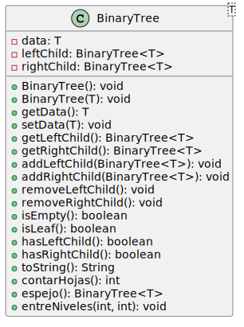
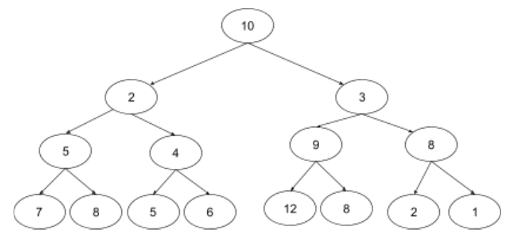
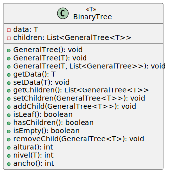
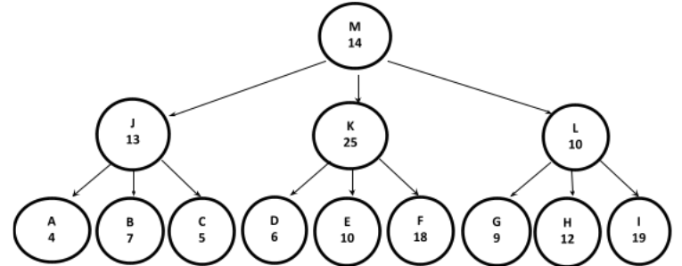
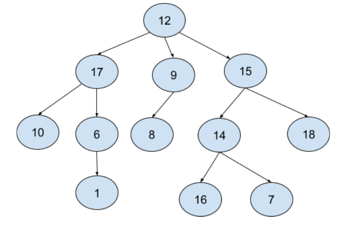
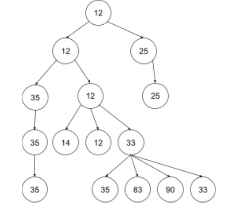
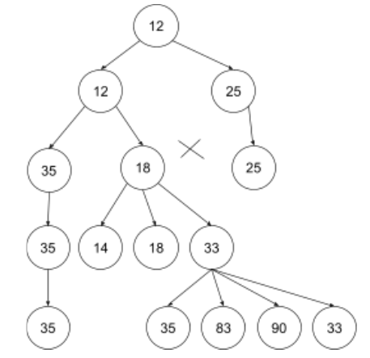
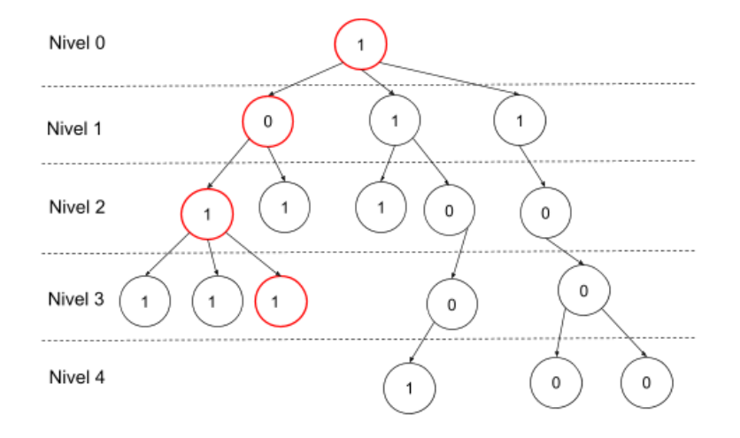

# Prácticas: 

### [Práctica 1: Listas.](#prc3a1ctica-1-listas-1)

### [Práctica 2: Árboles Binarios](#prc3a1ctica-2-c3a1rboles-binarios-1).

### [Práctica 3: Árboles Generales](#prc3a1ctica-2-c3a1rboles-generales-1).

## Práctica 1: Listas.

## Práctica 2: Árboles Binarios.
Implemente cada ejercicio en un paquete que contenga los números del TP y del ejercicio. Ejemplo tp2.ejercicio3 (dentro del proyecto llamado “AYED”).



### [Ejercicio 1](AYED/src/tp2/ejercicio01/BinaryTree.java)
Considere la siguiente especificación de la clase Java BinatyTree(con la representación hijo izquierdo e hijo derecho).

- El constructor `BinaryTree(T data)` inicializa un árbol con el dato pasado como parámetro y ambos hijos nulos.
- Los métodos `getLeftChild():BinaryTree<T>` y `getRightChild():BinaryTree<T>`, retornan los hijos izquierdo y derecho respectivamente del árbol. Si no tiene el hijo tira error.
- El método `addLeftChild(BinaryTree<T> child)` y `addRightChild(BinaryTree<T> child)` agrega un hijo como hijo izquierdo o derecho del árbol.
- El método `removeLeftChild()` y `removeRightChild()`, eliminan el hijo correspondiente.
- El método `isEmpty()` indica si el árbol está vacío y el método `isLeaf()` indica si no tiene hijos.
- El método `hasLeftChild()` y `hasRightChild()` devuelve un booleano indicando si tiene dicho hijo el árbol receptor del mensaje.

**a)** Analice la implementación en JAVA de la clase `BinaryTree` brindada por la cátedra.

### [Ejercicio 2](AYED/src/tp2/ejercicio02)
Agregue a la clase `BinaryTree` los siguientes métodos:
- `contarHojas():int`. Devuelve la cantidad de árbol/subárbol hojas del árbol receptor.

```java
//RESOLUCIÓN

public int contarHojas() {
	int total = 0;
		
	if (this.isLeaf()) 
		total = 1;
	else
		if (this.hasLeftChild())
			total = this.getLeftChild().contarHojas();
	
		if (this.hasRightChild())
			total+= this.getRightChild().contarHojas();

	return total;
}
```

- `espejo(): BinaryTree<T>`. Devuelve el árbol binario espejo del árbol receptor.
```java
//RESOLUCIÓN

public BinaryTree<T> espejo() {
	BinaryTree<T> nodo = new BinaryTree<T>(this.getData());
	
	if (!this.isLeaf()) {
					
		if (this.hasLeftChild()) 
			nodo.addRightChild(this.getLeftChild().espejo());
			
		if (this.hasRightChild()) 
			nodo.addLeftChild(this.getRightChild().espejo());

	}
	return  nodo;
}
```

- `entreNiveles(int n, m)`. Imprime el recorrido por niveles de los elementos del árbol receptor entre los niveles n y m (ambos inclusive). (0 ≤ n < m ≤ altura del árbol).

```java
//RESOLUCIÓN

public void entreNiveles(int n, int m) {
	BinaryTree<T> nodo = new BinaryTree<T>(this.getData());
	Queue<BinaryTree<T>> cola = new Queue<BinaryTree<T>>();

	cola.enqueue(this);
	cola.enqueue(null);
		
	int nivel = 0;
		
	while (!cola.isEmpty() && nivel <= m) {
		nodo = cola.dequeue();
			
		if (nodo != null) {
			System.out.print(nodo.getData()+" - ");
			
			if (nodo.hasLeftChild())
				cola.enqueue(nodo.getLeftChild());
			
			if (nodo.hasRightChild())
				cola.enqueue(nodo.getRightChild());
		}
		else {
			if (!cola.isEmpty()) 
				nivel++;
				cola.enqueue(null);
		}
	}
}
```

### [Ejercicio 3](AYED/src/tp2/ejercicio03/ContadorArbol.java)
Defina una clase Java denominada `ContadorArbol` cuya función principal es proveer métodos de validación sobre árboles binarios de enteros. Para ello la clase tiene como variable de instancia un `BinaryTree<Integer>`. Implemente en dicha clase un método denominado `numerosPares()` que devuelve en una estructura adecuada (sin ningún criterio de orden) todos los elementos pares del árbol (divisibles por 2).
- Implemente el método realizando un recorrido InOrden.
- Implemente el método realizando un recorrido PostOrden.

```java
//RESOLUCIÓN

public class ContadorArbol {

	private BinaryTree<Integer> abbEnteros;
	
	public ContadorArbol(BinaryTree<Integer> abbEnteros) {
		this.abbEnteros = abbEnteros;
	}
	
  // Implemente el método realizando un recorrido InOrden.
	public List<Integer> numerosParesInorden(){
		List<Integer> listaEnteros = new ArrayList<Integer>();
		
		if (!this.abbEnteros.isEmpty()) {
			this.numerosParesInorden(listaEnteros, this.abbEnteros);
		}
		
		return listaEnteros;
	}
	
	private void numerosParesInorden(List<Integer> listaEnteros, BinaryTree<Integer> abb){
		Integer num = abb.getData();
		
		if (abb.hasLeftChild())
			this.numerosParesInorden(listaEnteros, abb.getLeftChild());
		
		if (num % 2 == 1)
			listaEnteros.add(num);
		
		if (abb.hasRightChild())
			this.numerosParesInorden(listaEnteros, abb.getRightChild());
	}
	

	//Implemente el método realizando un recorrido PosOrden.
	public List<Integer> numerosParesPostOrden(){
		List<Integer> listaEnteros = new ArrayList<Integer>();
		
		if (!this.abbEnteros.isEmpty()) {
			this.numerosParesPostOrden(listaEnteros, this.abbEnteros);
		}
		
		return listaEnteros;
	}
	
	private void numerosParesPostOrden(List<Integer> listaEnteros, BinaryTree<Integer> abb){
		Integer num = abb.getData();
		
		if (abb.hasLeftChild())
			this.numerosParesPostOrden(listaEnteros, abb.getLeftChild());
		
		if (abb.hasRightChild())
			this.numerosParesPostOrden(listaEnteros, abb.getRightChild());
		
		if (num % 2 == 1)
			listaEnteros.add(num);
	}
}
```

### [Ejercicio 4](AYED/src/tp2/ejercicio04/)
Una red binaria es una red que posee una topología de árbol binario lleno. Por ejemplo:



Los nodos que conforman una red binaria llena tiene la particularidad de que todos ellos conocen cuál es su retardo de reenvío. El retardo de reenvío se define como el período comprendido entre que un nodo recibe un mensaje y lo reenvía a sus dos hijos.

Su tarea es calcular el mayor retardo posible, en el camino que realiza un mensaje desde la raíz hasta llegar a las hojas en una red binaria llena. En el ejemplo, debería retornar 10+3+9+12=34 (Si hay más de un máximo retorne el último valor hallado).

> Nota: asuma que cada nodo tiene el dato de retardo de reenvío expresado en cantidad de segundos.

1. Indique qué estrategia (recorrido en profundidad o por niveles) utilizará para resolver el problema.
2. Cree una clase Java llamada RedBinariaLlena donde implementará lo solicitado en el método `retardoReenvio():int`

```java
// VERSIÓN 1
public class RedBinariaLlena {

	private BinaryTree<Integer> binaryTree;
	
	public RedBinariaLlena(BinaryTree<Integer> binaryTree) {
		this.binaryTree = binaryTree;
	}
	
	public int retardoReenvio() {
		if (!this.binaryTree.isEmpty())
			return this.recorridoEnProfundidad(this.binaryTree);
		else
			return -1;
	}
	
	private int recorridoEnProfundidad(BinaryTree<Integer> binaryTree) {
		int subIzq = 0;
		int subDer = 0;
		
		if (binaryTree.isLeaf()) 
			return binaryTree.getData();
		
		else {
			if (binaryTree.hasLeftChild())
				subIzq+= recorridoEnProfundidad(binaryTree.getLeftChild());
			if (binaryTree.hasLeftChild())
				subDer+= recorridoEnProfundidad(binaryTree.getRightChild());
			
			return (Math.max(subIzq, subDer) + binaryTree.getData());
		}
	}
}

```

```java
// VERSIÓN 2
public class RedBinariaLlena2 {

	private BinaryTree<Integer> binaryTree;

	public RedBinariaLlena2(BinaryTree<Integer> binaryTree) {
		this.binaryTree = binaryTree;
	}
	
	public int retardoReenvio() {
		return this.retardo(binaryTree);
	}

	private int retardo(BinaryTree<Integer> arbol) {

		if (arbol == null || arbol.isEmpty())
			return 0;

		int valorI = retardo(arbol.getLeftChild()); // no hay que preguntar si es null, sale antes.
		int valorD = retardo(arbol.getRightChild());

		return Math.max(valorI, valorD) + arbol.getData();
	}

}
```

## Práctica 3: Árboles Generales.



### [Ejercicio 1](AYED/src/tp3/ejercicio01/GeneralTree.java)

Considere la siguiente especificación de la clase `GeneralTree` (con la representación de Lista de Hijos).

- El constructor `GeneralTree(T data)` inicializa un árbol que tiene como raíz un nodo y este nodo tiene
el dato pasado como parámetro y una lista vacía.
- El constructor `GeneralTree(T data, List<GeneralTree <T>> children)` inicializa un árbol que
tiene como raíz a un nodo y este nodo tiene el dato pasado como parámetro y como hijos children.
- El método `getData():T` retorna el dato almacenado en la raíz del árbol.
- El método `getChildren():List<GeneralTree<T>>`, retorna la lista de hijos de la raíz del árbol.
- El método `addChild(GeneralTree <T> child)` agrega un hijo al final de la lista de hijos del árbol
- El método `removeChild(GeneralTree <T> child)` elimina del árbol el hijo pasado como parámetro.
- El método `hasChildren()` devuelve verdadero si la lista de hijos del árbol no es null y tampoco es
vacía
- El método `isEmpty()` devuelve verdadero si el dato del árbol es null y además no tiene hijos.
- Los métodos `altura()`, `nivel(T)` y `ancho()` se resolverán en el ejercicio 3.
- Analice la implementación en JAVA de la clase GeneralTree brindada por la cátedra.

### [Ejercicio2](AYED/src/tp3/ejercicio02/)
**a)** Implemente en la clase `RecorridosAG` los siguientes métodos:

1. `public List<Integer> numerosImparesMayoresQuePreOrden(GeneralTree <Integer> a, Integer n)`
	- Método que retorna una lista con los elementos impares del árbol “a” que sean mayores al valor “n” pasados como parámetros, recorrido en preorden.

	```java
	public static List<Integer> numerosImparesMayoresQuePreOrden(GeneralTree<Integer> a, Integer n) {
		List<Integer> listaEnteros = new ArrayList<Integer>();

		if (!a.isEmpty()) {
			numerosImparesMayoresQuePreOrden(a, n, listaEnteros);
			return listaEnteros;
		} else
			return listaEnteros;
	}

	private static void numerosImparesMayoresQuePreOrden(GeneralTree<Integer> a, Integer n, List<Integer> listaEnteros) {
		int dato = a.getData();

		if (dato % 2 == 1 && dato > n) {
			listaEnteros.add(dato);
		}

		if (a.hasChildren()) {
			List<GeneralTree<Integer>> hijos = a.getChildren();

			for (GeneralTree<Integer> hijo : hijos) {
				numerosImparesMayoresQuePreOrden(hijo, n, listaEnteros);
			}
		}
	}
	```

2. `public List<Integer> numerosImparesMayoresQueInOrden (GeneralTree <Integer> a, Integer n)`
	- Método que retorna una lista con los elementos impares del árbol “a” que sean mayores al valor “n” pasados como parámetros, recorrido en inorden.

	```java
	public static List<Integer> numerosImparesMayoresQueInOrden(GeneralTree<Integer> a, Integer n) {
		List<Integer> listaEnteros = new ArrayList<Integer>();

		if (!a.isEmpty()) {
			numerosImparesMayoresQueInOrden(a, n, listaEnteros);
			return listaEnteros;
		} else
			return listaEnteros;

	}

	private static void numerosImparesMayoresQueInOrden(GeneralTree<Integer> a, Integer n, List<Integer> listaEnteros) {

		List<GeneralTree<Integer>> hijos = a.getChildren();

		Iterator<GeneralTree<Integer>> i = hijos.iterator();

		if (a.hasChildren())
			numerosImparesMayoresQueInOrden(i.next(), n, listaEnteros);

		if (a.getData() % 2 == 1 && a.getData() > n)
			listaEnteros.add(a.getData());

		while (i.hasNext()) {
			numerosImparesMayoresQueInOrden(i.next(), n, listaEnteros);
		}
	}
	```


3. `public List<Integer> numerosImparesMayoresQuePostOrden (GeneralTree <Integer> a, Integer n)`
	- Método que retorna una lista con los elementos impares del árbol “a” que sean mayores al valor “n”
pasados como parámetros, recorrido en postorden.
	```java
	public static List<Integer> numerosImparesMayoresQuePostOrden(GeneralTree<Integer> a, Integer n) {
		List<Integer> listaEnteros = new ArrayList<Integer>();

		if (!a.isEmpty()) {
			numerosImparesMayoresQuePostOrden(a, n, listaEnteros);
			return listaEnteros;
		} else
			return listaEnteros;
	}

	private static void numerosImparesMayoresQuePostOrden(GeneralTree<Integer> a, Integer n, List<Integer> listaEnteros) {

		if (a.hasChildren()) {
			List<GeneralTree<Integer>> hijos = a.getChildren();

			for (GeneralTree<Integer> hijo : hijos) {
				numerosImparesMayoresQuePostOrden(hijo, n, listaEnteros);

			}
		}

		int dato = a.getData();
		if (dato % 2 == 1 && dato > n) {
			listaEnteros.add(dato);
		}
	}
	```

4. `public List<Integer> numerosImparesMayoresQuePorNiveles(GeneralTree <Integer> a, Integer n)`
	- Método que retorna una lista con los elementos impares del árbol “a” que sean mayores al valor “n”
pasados como parámetros, recorrido por niveles.
```java

```
**b)** Si ahora tuviera que implementar estos métodos en la clase GeneralTree<T>, ¿qué modificaciones haría tanto en la firma como en la implementación de los mismos?

### [Ejercicio3](AYED/src/tp3/ejercicio01/GeneralTree.java)

Implemente en la clase GeneralTree los siguientes métodos

- `public int altura()` devuelve la altura del árbol, es decir, la longitud del camino más largo desde el nodo raíz hasta una hoja.

	```java
	public int altura() {	 
		int altura = 0;
		
		if (this.hasChildren()) {
			altura = -1;
			
			List<GeneralTree<T>> hijos = this.getChildren();

			for (GeneralTree<T> nodo : hijos) 
				altura = Math.max(altura, nodo.altura());
			
			altura++;
		}
		return altura;
	}
	```

- `public int nivel(T dato)` devuelve la profundidad o nivel del dato en el árbol. El nivel de un nodo
es la longitud del único camino de la raíz al nodo.
	```java
	public int nivel(T dato){
		GeneralTree<T> nodo = new GeneralTree<T>();
		Queue<GeneralTree<T>> queue = new Queue<>();
		
		queue.enqueue(this);
		queue.enqueue(null);
		
		int profundidad = 0;
		while (! queue.isEmpty()) {
			nodo = queue.dequeue();
			
			if ((nodo != null) ) {
				
				if (nodo.getData().equals(dato))
					return profundidad;
				
				if (nodo.hasChildren()) {
					List<GeneralTree<T>> hijos = nodo.getChildren();
					for (GeneralTree<T> hijo: hijos) {
						queue.enqueue(hijo);
					}
				}
			}
			else
				if (! queue.isEmpty()) {
					profundidad++;
					queue.enqueue(null);
				}
		}
		
		return -1;
	  }
	```

- `public int ancho()` la amplitud (ancho) de un árbol se define como la cantidad de nodos que
se encuentran en el nivel que posee la mayor cantidad de nodos.
	```java
	public int ancho(){
		int hijosMax = 1;

		if (this.hasChildren()) {
			hijosMax = this.getChildren().size();
			Iterator<GeneralTree<T>> hijos = this.getChildren().iterator();
			
			while (hijos.hasNext()) {
				hijosMax = Math.max(hijos.next().ancho(), hijosMax);
			}	
		}	
		return hijosMax;
	}
	```
### [Ejercicio4](AYED/src/tp3/ejercicio04)
El esquema de comunicación de una empresa está organizado en una estructura jerárquica, en donde cada nodo envía el mensaje a sus descendientes. Cada nodo posee el tiempo que tarda en transmitir el mensaje.



Se debe devolver el mayor promedio entre todos los valores promedios de los niveles.

Para el ejemplo presentado, el promedio del nivel 0 es 14, el del nivel 1 es 16 y el del nivel 2 es 10. Por lo tanto, debe devolver 16.

**a)** Indique y justifique qué tipo de recorrido utilizará para resolver el problema.

**b)** Implementar en una clase AnalizadorArbol, el método con la siguiente firma: `public double devolverMaximoPromedio (GeneralTree<AreaEmpresa>arbol)`

Donde **AreaEmpresa** es una clase que representa a un área de la empresa mencionada y que contiene la identificación de la misma representada con un **String** y una tardanza de transmisión de mensajes interna representada con **int**.

```java
public double devolverMaximoPromedio(GeneralTree<AreaEmpresa> arbol) {
	if (arbol.isEmpty()) {
		return -1;
	}
	else
		return devolverPromedio(arbol);
}
	
private double devolverPromedio(GeneralTree<AreaEmpresa> arbol) {
	GeneralTree<AreaEmpresa> nodoAux;
	Queue<GeneralTree<AreaEmpresa>> queue = new Queue<>();
		
	queue.enqueue(arbol);
	queue.enqueue(null);
		
	int maxPromedio = -1;
	int sumaPorNivel = 0;
	int nodosPorNivel = 0;
		
	while (! queue.isEmpty()) {
		nodoAux = queue.dequeue();
		
		if (nodoAux != null) {
			sumaPorNivel+= nodoAux.getData().getTardanza();
			nodosPorNivel+= 1;
				
			if (nodoAux.hasChildren()) {
				Iterator<GeneralTree<AreaEmpresa>> i = nodoAux.getChildren().iterator();
				while(i.hasNext())
					queue.enqueue(i.next());
			}		
		}
		else
			if (! queue.isEmpty() || nodosPorNivel != 0) {
				queue.enqueue(null);
				maxPromedio = Math.max(sumaPorNivel/nodosPorNivel, maxPromedio);
				sumaPorNivel = 0;
				nodosPorNivel = 0;
			}
	}
		
	return maxPromedio;
}
```

### [Ejercicio 5](AYED/src/tp3/ejercicio01/GeneralTree.java)
Se dice que un nodo n es ancestro de un nodo m si existe un camino desde n a m. Implemente un método en la clase `GeneralTree` con la siguiente firma:
`public boolean esAncestro(T a, T b)`: devuelve true si el valor “a” es ancestro del valor “b”.

```java
public boolean esAncestro(T a, T b) {
	GeneralTree<T> nodoA = buscarNodo(this, a);
	if (nodoA == null || nodoA.isEmpty())
		return false;
	else
		return (buscarNodo(nodoA, b) != null) || (! buscarNodo(nodoA, b).isEmpty());
}

public GeneralTree<T> buscarNodo(GeneralTree<T> ag, T x) {
	GeneralTree<T> nodo = new GeneralTree<T>();
		
	if (ag.getData().equals(x)) {
		nodo = ag;
			
	} else {
		Iterator<GeneralTree<T>> hijos = ag.getChildren().iterator();
			
		while (hijos.hasNext() && (nodo.isEmpty() || nodo == null)) {
			nodo = buscarNodo(hijos.next(), x);				
		}
	}
		
	return nodo;
}
```

### [Ejercicio 6](AYED/src/tp3/ejercicio06)
Sea una red de agua potable, la cual comienza en un caño maestro y la misma se va dividiendo sucesivamente hasta llegar a cada una de las casas. </br>
Por el caño maestro ingresan “x” cantidad de litros y en la medida que el caño se divide, de acuerdo con las bifurcaciones que pueda tener, el caudal se divide en partes iguales en cada una de ellas. Es decir, si un caño maestro recibe 1000 litros y tiene por ejemplo 4 bifurcaciones se divide en 4 partes iguales, donde cada división tendrá un caudal de 250 litros.</br>
Luego, si una de esas divisiones se vuelve a dividir, por ej. en 5 partes, cada una tendrá un caudal de 50 litros y así sucesivamente hasta llegar a un lugar sin bifurcaciones.

Se debe implementar una clase RedDeAguaPotable que contenga el método con la siguiente firma: `public double minimoCaudal(double caudal)`

Hay que calcular el caudal de cada nodo y determiner cuál es el caudal mínimo que recibe una casa. Asuma que la estructura de caños de la red está representada por una variable de instancia de la clase `RedAguaPotable` y que es un `GeneralTree<Character>`.

Extendiendo el ejemplo en el siguiente gráfico, al llamar al método minimoCaudal con un valor de 1000.0 debería retornar 25.0.

```java

```

### [Ejercicio 7](AYED/src/tp3/ejercicio07)
Dada una clase `Caminos` que contiene una variable de instancia de tipo GeneralTree de números enteros, implemente un método que retorne el camino a la hoja más lejana. En el caso de haber más de un camino máximo retorne el primero que encuentre.

El método debe tener la siguiente firma: `public List<Integer> caminoAHojaMasLejana()`

Por ejemplo, para el siguiente árbol, la lista a retornar seria: 12, 17, 6, 1 de longitud 3 (Los caminos 12, 15, 14, 16 y 12, 15, 14, 7 son también máximos, pero se pide el primero).



```java
public class Caminos {

	GeneralTree<Integer> agInt;
	
	public Caminos(GeneralTree<Integer> arbolDeEnteros) {
		agInt = arbolDeEnteros;
	}
	
// VERSIÓN 1
	public List<Integer> caminoAHojaMasLejana(){
		List<Integer> caminoActual = new ArrayList<Integer>();
		List<Integer> caminoMax = new ArrayList<Integer>();
		
		recorrido(agInt, caminoActual, caminoMax);
		
		return caminoMax;
	}
	
	private void recorrido(GeneralTree<Integer> ag, List<Integer> caminoAct, List<Integer> caminoMax) {
		caminoAct.add(ag.getData());
		
		if (ag.isLeaf()) {
			if (caminoMax.size() < caminoAct.size()) {
				caminoMax.addAll(0, caminoMax);
				actualizarListaMax(caminoAct, caminoMax);
			}
		} 
		else {			
			List<GeneralTree<Integer>> hijos = ag.getChildren();
			for (GeneralTree<Integer> hijo : hijos) {
				recorrido(hijo, caminoAct, caminoMax);
			}
		}
		caminoAct.removeLast();
	}
	
	
	private void actualizarListaMax(List<Integer> caminoAct, List<Integer> caminoMax) {
		Iterator<Integer> i = caminoAct.iterator();
		while (i.hasNext()) {
			caminoMax.add(i.next());
		}
		caminoAct.removeAll(caminoAct);
	}

//VERSIÓN 2
	public List<Integer> recorrido2(GeneralTree<Integer> ag){
		List<Integer> listaAct = new ArrayList<Integer>();
		
		if (ag.isEmpty())		//retorno lista vacía
			return listaAct;
		
		if (ag.isLeaf()) {		//retorna la lista con la hoja
			listaAct.add(ag.getData());
			return listaAct;
		}
		
		List<GeneralTree<Integer>> hijos = ag.getChildren();
		for (GeneralTree<Integer> hijo : hijos) {
			//lista de hijos donde calculo cual tiene más
			List<Integer> listaHijos = recorrido2(hijo);
			
			if (listaHijos.size() > listaAct.size())
				listaAct = recorrido2(hijo);
		}
		
		//agrego el padre a la lista de hijos que más tenía
		listaAct.add(ag.getData());	
		
		return listaAct;
	}	
}
```

### [Ejercicio 8]()
Retomando el ejercicio abeto navideño visto en teoría, cree una clase `Navidad` que cuenta con una variable de instancia GeneralTree que representa al abeto (ya creado) e implemente el método con la firma: `public String esAbetoNavidenio()`

```java

```

### [Ejercicio 9](AYED/src/tp3/ejercicio09/Ejercicio09.java)
Implemente en la clase `ParcialArboles` el método: `public static boolean esDeSeleccion (GeneralTree<Integer> arbol)`
que devuelve true si el árbol recibido por parámetro es de selección, falso sino lo es.

Un árbol general es de selección si cada nodo tiene en su raíz el valor del menor de sus hijos.Por ejemplo, para el siguiente árbol se debería retornar: **true**.



Para este otro árbol se debería retornar **false** (el árbol con raíz 18 tiene un hijo con valor mínimo 14 ).



```java
public static boolean esDeSeleccion(GeneralTree<Integer> arbol) {
	boolean esDeSeleccion = true;
		
	if ((arbol == null) || (arbol.isEmpty()))
		esDeSeleccion = false;
		
	if (esDeSeleccion && arbol.hasChildren()) {
		GeneralTree<Integer> hijoMin = new GeneralTree<Integer>(9999);
		GeneralTree<Integer> hijo;
			
		Iterator<GeneralTree<Integer>> i = arbol.getChildren().iterator();
			
		while (i.hasNext() && esDeSeleccion) {
			hijo = i.next();
			if (hijoMin.getData() > hijo.getData()) {
				hijoMin = hijo;
			}
			esDeSeleccion = esDeSeleccion(hijo);
		}
			
		if (esDeSeleccion && (arbol.getData() != hijoMin.getData())) {
			esDeSeleccion = false;
		}
	}
		
	return esDeSeleccion;
}
```

### [Ejercicio 10]()
Implemente la clase `ParcialArboles`, y el método: `public static List<Integer> resolver(GeneralTree<Integer> arbol)` que recibe un árbol general de valores enteros, que solo pueden ser 0 o 1 y devuelve una lista con los valores que componen el **"camino filtrado de valor máximo”**, se llama “filtrado” porque sólo se agregan al camino los valores iguales a 1 (los 0 no se agregan), mientras que es “de valor máximo” porque se obtiene de realizar el siguiente cálculo: es la suma de los valores de los nodos multiplicados por su nivel. De haber más de uno, **devolver el primero que se encuentre**.

Por ejemplo, para el árbol general que aparece en el gráfico, el resultado de la invocación al método **resolver** debería devolver una lista con los valores: 1, 1, 1 , y NO 1, 0 , 1, 1 dado que filtramos el valor 0.

Con esa configuración se obtiene el mayor valor según el cálculo: 1 * 0 + 0 * 1 + 1 * 2 + 1 * 3. (El camino 1 * 0 + 1 * 1 + 0 * 2 + 0 * 3 + 1 * 4 también da 5, pero no es el primero).



> Nota: No puede generar la lista resultado con 0 / 1 y en un segundo recorrido eliminar los elementos con valor 0.

```java

```

### [Ejercicio 11]()

