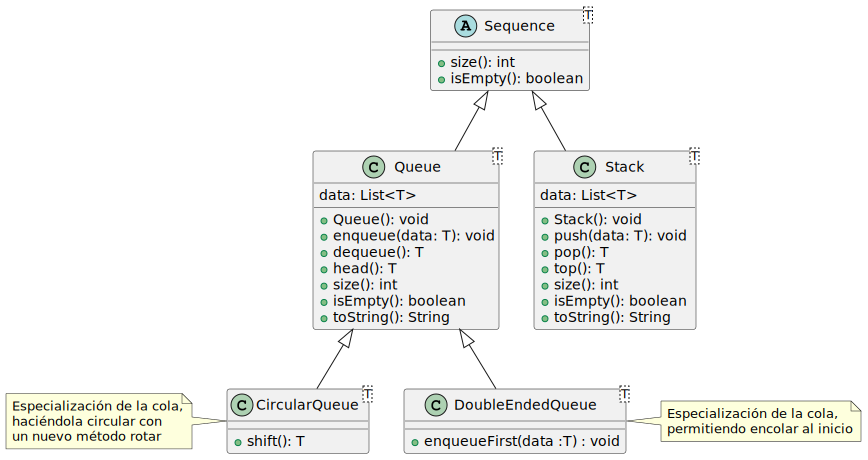
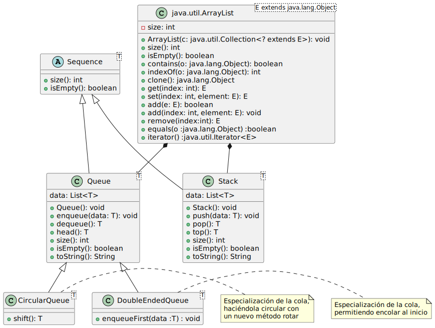

<h1 align="center">Algoritmos y Estructuras de Datos</h1>

## [Práctica](Practica#prácticas)

## Temas que se abarcan
### [Estructuras de datos lineales.]()
- [Tipos de datos abstractos (Abstract Data Type)]()
	- Listas.
	- Pilas.
	- Colas.

### [Estructuras de dato no lineales.]()
- Árboles Binarios.
- Árboles Generales.
- Colas de prioridad.
- Grafos.

### [Análisis de algoritos]().
- Cálculo de tiempo de ejecución.
- Orden de ejecución de los algorimots.

### [Otros]()
- Framework de colecciones en java
	- Tecnologías de almacenamiento
	- Implementaciones de listas porvistas por la API: LinkedList y ArrayList
- Tipos Genéricos
- Iteradores


## Clases en Java
#### Una clase es un bloque de código o un molde, que describe el estado y el comportamiento que tendrán los objetos que con ella se creen.
- Un archivo origen en java debe tener como mínimo:
	- en la primera línea la palabra clave _package_ seguida del nombre del paquete.
	- la palabra clave _class_ seguida del nombre de la clase.
- Um archivo origem java debe guardarse con el mismo nombre que la clase (y con extensión _.java_)

### Declaración de una Clase
Para agregar estado y comportamiento debemos incluir:

**Variables de instancia:** consituyen el estado de un objeto. Normalmente, las variables de instancia se declaran como **_private_**, lo que significa que se puede acceder a ellas directamente sólo desde la clase donde se definen.
- La declaración de una variable incluye: 
	- un **identificador** o nombre de la variable.
	- un **tipo** de dato primitivo o referencial.
	- un especificador de acceso (opcional).


**Métodos de instancia:** definen las operaciones que pueden realizar los objetos de un tipo de clase. Un método es un bloque de código, similar a los que es una función o procedimiento en los lenguajes procedurales como PASCAL.
- La declaración de un método especifica:
	- un **nombre**.
	- una lista opcional de **argumentos**
	- un **tipo** de retorno.
	- un **modificador de acceso** (opcional).

## Tipo de datos en java
En **Java** hay dos tipos de datos: primitivo y referencial o de una clase en particular.

#### Tipo primitivos:
Las varbiables de tipo primitivo mantienen valores simples y NO son objetos. Existen 8 tipos de datos primitivos.
- **Entero**: byte, short, int, long
- **Punto flotante**: float y double
- Un **carácter** de texto: char
- **Lógico**: boolean

#### Tipos de una clase:
Las variables que referencias a un **objeto** son llamadas **variables de referencia** y contienen la ubicación (dirección de memoria) de objetos en memoria.

### Inicialización de datos
Si la definición de una clase, no inicializa variables de instancia, las mismas toman valores por defecto.
- Las variables de instancia de tipo **primitivo** se inicializan con los siguientes valores por defecto:
	- boolean = false 
	- char = '\uoooo' (nulo)
	- byte, short, int, long = 0
	- flat, double = 0.0

- Las variables de instancia que son referencias a objetos, se inicializan con el valor por defecto **null**.

### Clases Wrappers
Java no considera a los tipos de datos primitivos como objetos, los datos numéricos, booleanos y de caracter se tratan en su forma primitiva por razones de eficiencia.

Java proporciona clases **wrappers** para manipular a los datos primitivos como objetos. Los datos primitivos están envueltos (wrapped) en un objeto que se crea en torno a ellos.

Cada tipo de dato primitivo en java, posee un clase _wrapper_ corresondiente en el paquete **java.lang**. Cada objeto de la clase _wrapper_ encapsula a un único valor primitivo.

- char = Character
- boolean = Boolean
- byte = Byte
- short = Short
- int = Integer
- long = Long
- float = Float
- double = Double

#### Autoboxing
Es la conversión automática que realiza el compilador de Java entre los tipos primitivos y sus clases wrapper corresondientes. Por ejemplo, convertir un int en un Integer.
```java
Integer num1 = 10;  // Autoboxing de int a Integer
Double num2 = 5.5;  // Autoboxing de double a Double
```


#### Unboxing
Es la conversiòn al revé, es decir conversión de wrapper a un primitivo. Por ejemplo, de Double a double.
```java
Integer num1 = new Integer(10);
int num2 = num1;  // Unboxing de Integer a int

Double num3 = new Double(5.5);
double num4 = num3;  // Unboxing de Double a double
```

#### Ejemplo del impacto de un algoritmo iterativo usando un tipo Long y luego un primitvo long

```java
Long suma = 0;
long antes = System.currentTimeMillis();
for (int i = 0; i < Integer.MAX_VALUE; i++){
	suma += i;
}
long despues = System.currentTimeMillis();
//ejecuciòn en aprox 37.66 seg.
```

```java
long suma = 0;
long antes = System.currentTimeMillis();
for (int i = 0; i < Integer.MAX_VALUE; i++){
	suma += i;
}
long despues= System.currentTimeMillis();
//ejecuciòn en aprox 5.526 seg.
```

## Creación de	instacias de una clase
Para instanciar una clase, es decir, para crear un objeto de una clase, se usa el operador **new**.

La creaciòn e inicializacíon de un objeto involucra los siguientes pasos:

1. Se aloca espacio para la variable
2. Se aloca espacio para el objeto en la _heap_ y se inicializan los atributos con los valores por defecto.
3. Se inicializan explìcitamente los atributos del objeto.
4. Se ejecuta el **constructor** (parecido a un método que tiene el mismo nombre que la clase).
5. Se asigna la referencia del nuevo objeto a la variable.

### Constructores
#### Sin argumentos:  
Un constructor sin argumentos o constructor _Default_, es usado para crear un objeto básico.
- Si una clase no tiene constructores, el compilador inserta automáticamente un constructor default, con cuerpo vacío.

```java
public class Vehiculo {
	private String marca;
	private double precio;

	/*
	public Vehiculo(){
		constructor implícito
	}
	*/

	//métodos
}
```
- Cuando se crea un objeto de la clase Vehiculo, con `new Vehiculo()`, se invocará el constructor por defecto, aún cuando no se encuentre explícitamente en la clase.
- Si la clase tiene al menos un constructor, con o sin argumentos, el compilador _no insertará nada_.

#### Con argumentos
Son usados para inicializar los valores del objeto que se está creando mediante el pasaje de parámetros en el mismo constructor.

```java
public class Vehiculo {
    private String marca;
    private String modelo;
    private int anio;

    // Constructor con parámetros
    public Vehiculo(String marca, String modelo, int anio) {
        this.marca = marca;
        this.modelo = modelo;
        this.anio = anio;
    }

	//métodos
}
```
- Si el constructor anterior fuera el único en la clase, no permitirá crear un objeto `Vehiculo` de otra manera que no sea usando ese constructo.

```java
Vehiculo vehiculo = new Vehiculo("Toyota", "Corolla", 2020);
```

## Variables de instancia y variables locales

### Variables y métodos de clase
#### Palabra clave `static`
La palabra clave _static_ declara atributos (variables) y métodos (funciones / procedimientos) con la clase, en lugar de asociarlos a cada una de las instancias de la clase. Esto significa que, en lugar de tener una copia de la variable o el método para cada una de las isntancias de la clase, solo habrá una copia para la clase en sí.

En ambos casos se debe anteponer la palabra clave `static` al tipo de dato de la variable o de retorno del método.

- Las _**variables de clase**_ son compartidas por todas las instancias de la clase, en lugar de una instancia específica de la clase.

```java
public class Test {
    public static int num;
}

Test a = new Test();
Test b = new Test();
a.num = 9;
System.out.println(b.num);  // Imprime 9
```
En el ejemplo anterior, `num` es un atributo estático de la clase `Test`. Cuando se cambia el valor de `num` en la instancia `a`, el cambio se refleja en todas las demás instancias de la clase `Test`, incluyendo `b`


- En el caso de los _**métodos de clase**_ se utilizan cuando se necesita algún tipo de comportamiento que no depende de una instancia particular.

```java
public class Rectangulo {
    public static double area(int lado1, int lado2) {
        return lado1 * lado2;
    }

    public static double perimetro(int lado1, int lado2) {
        return lado1 * 2 + lado2 * 2;
    }
}

System.out.println(Rectangulo.area(2, 2));  // Imprime el área de un rectángulo con lados de longitud 2
```
En el ejemplo anterior, `area` y `perimetro` son métodos estáticos de la clase `Rectangulo`. Estos métodos pueden ser invocados directamente en la clase `Rectangulo`, sin necesidad de crear una instancia de la clase `Rectangulo`. 

Los **métodos de clase** solo tienen acceso a sus variables locales, parámetros y variables de clase, y **no tienen acceso a las variables de instancia**.

## Pasaje de parámetros en Java
En Java los parámetros **se pasan por valor**. Esto significa que cuando un método se invoca, los argumentos se pasan _como una copia de cada parámetro actual_.

```java
public class PasajePorValor {

	//parámetros formales: son los parámetros en la definición del método.
	public static int mult(int x, int y) { 
		return x * y;
	}

	//paránetros actuales/reales: son los parámetros en la invocación al método.
	public static void main(String[] args) {
		int alto = 10;
		int ancho = 5;
		int area = mult(alto, ancho);
	}
}
```
> Dentro del cuerpo de un método se puede cambiar el valor de la copia que se recibe como parámetro, pero no tendrá efecto en el parámetro actual

### Tipo de dato _primitivo_
Cuando _Java_ llama a un método, hace una copia de sus parámetros reales y envía las copias al método. Cuando el método finaliza, esas copias se descartan y los valores de las variables en el código principal seguirán siendo las mismas que antes (**pasaje por valor**).

```java
import java.util.Scanner;
public class TestPasajeParametros {
	public static void pedirEdades(int edad1, int edad2) {
		Scanner input = new Scanner(System.in); // Create a Scanner object
		System.out.println("Ingrese la edad de la madre:"); 
		edad1 = input.nextInt();	// se ingresa 53
		System.out.println("Ingrese la edad del hijo mayor:");
		edad2 = input.nextInt();	// se ingresa 23
	}
	public static void main(String[] args) {
		int edadMadre = 0;
		int edadHijo = 0;
		TestPasajeParametros.pedirEdades(edadMadre, edadHijo);
		System.out.println("La madre tuvo a su primer hijo a los:"+(edadMadre-edadHijo)+" años”);
		//se imprime: La madre tuvo a su primer hijo a los: 0 años
	}
}
```

### Clases wrapper y clase String
Las clases wrapper (Integer, Char, etc) y las instancias de String son **inmutables**, esto significa que su valor no puede cambiar, de manera que cuando se modifica el valor a una variable de este tipo, se crea una nueva instancia con el nuevo valor y se le asigna a la variable.
```java
import java.util.Scanner;
public class TestPasajeParametros {
	public static void pedirEdades(Integer edad1, Integer edad2) {
		Scanner input = new Scanner(System.in); // Create a Scanner object
		System.out.println("Ingrese la edad de la madre:"); 
		edad1 = input.nextInt();	// se ingresa 53
		System.out.println("Ingrese la edad del hijo mayor:");
		edad2 = input.nextInt();	// se ingresa 23
	}
	public static void main(String[] args) {
		Integer edadMadre = 0;
		Integer edadHijo = 0;
		TestPasajeParametros.pedirEdades(edadMadre, edadHijo);
		System.out.println("La madre tuvo a su primer hijo a los:"+(edadMadre-edadHijo)+" años”);
		// se imprime: La madre tuvo a su primer hijo a los: 0 años
	}
}
```
- Cuando se intenta pasar un objeto de una clase envolvente (como Integer) a un método, lo que **se pasa** en realidad es una **copia de la referencia al objeto**. Si se intenta cambiar el objeto dentro del método (como se intenta en el método `pedirEdades`), en realidad se está cambiando la copia de la referencia, no la referencia original. Por lo tanto, los cambios no se reflejan en las variables originales (`edadMadre` y `edadHijo`).

### Tipo de dato referencial
En _Java_ podemos pasar como parámetro una referencia a un objeto y con ella cambiar el estado (valor de sus variables) del objeto, pero no la referencia.

```java
public class PasajePorValor {
	public static void cambiarNombre(Contacto c) {
		c.setNombre("Pilar");
	}

	public static void main(String[] args){
		Contacto c = new Contacto();
		c.setNombre("Lucia");
		PasajePorValor.cambiarNombre(c); //se pasa una copia de la referencia a "c"
		System.out.println(c.getNombre());
	}
}
```
- Aunque se está pasando una copia de la referencia a `c`, el método `cambiarNombre` puede cambiar el estado del objeto `Contacto` al que apunta `c` porque ambos apuntan al mismo objeto en memoria.

Si al ejemplo anterior lo modificamos de la siguiente manera: 
```java
public class PasajePorValor {
	public static void cambiarNombre(Contacto c) {
		c = new Contacto();
		c.setNombre("Cositorto");
	}

	public static void main(String[] args){
		Contacto c = new Contacto();
		c.setNombre("Lucia");
		PasajePorValor.cambiarNombre(c); //se pasa una copia de la referencia a "c"
		System.out.println(c.getNombre());
	}
}
```
- Aunque se pasa una copia de la referencia de `c` al método `cambiarNombre`, el método no puede cambiar la referencia original de `c` para que apunte al nuevo objeto `Contacto`, solo puede modificar la copia de la referencia que se pasa al método. Por lo tanto después de la llamada a `cambiarNombre()`, el nombre del objeto `Contacto` (`c`) en el método `main` seguirá siendo "Lucía".

## Tipos de dato abstracto
Un tipo de dato abstracto (TDA) (en inglés, ADT por Abstract Data Type) es un tipo definido solamente en términos de sus operaciones y de las restricciones que valen entre las operaciones.
- Cada TDA se representa en esta asignatura como una clase o varias clases abstractas o interface.
- Una o más implementaciones del TDA se brindan en términos de clases concretas.

### TDA Lista (List)
Una lista es una secuencia lineal de elementos que pueden manipularse libremente, se puede agregar y eliminar elementos en cualquier posición de la misma.

#### Operaciones
- `add(e)`: agrega un elemento e en la última posición.
- `add(pos, e)`: agrega un elemento e en la posición e.
- `get(pos)`: recupera el elemento de la posición pos.
- `indexOf`: retorna el índice de la primera ocurrencia de e.
- `remove(pos)`: elimina el elemento de la posición pos.
- `remove(e)`: elimina el elemento e.
- `contains(e)`: retorna true si e está en la lista, false en caso contrario
- `size()`: Retorna un entero natural que indica cuántos elementos hay en la lista.

### TDA Pila (Stack)
Una pila es una secuancia lineal de objetos actualizada en un extremo llamado tope usando una política _LIFO_ (last-in first-out, el primero en entrar es el últio en salir).

#### Operaciones
- `push(e)`: Inserta el elemento e en el tope de la pila.
- `pop()`: Elimina el elemento del tope de la pila y lo entrega como resultado. Si se aplica a una pila vacía, produce una situación de error.
- `isEmpty()`: Retorna verdadero si la pila no contiene elementos y falso en caso contrario.
- `top()`: Retorna el elemento del tope de la pila. Si se aplica a una pila vacía, produce una situación de error.
- `size()`: Retorna un entero natural que indica cuántos elementos hay en la pila.

### TDA Cola (Queue)
Una cola es una secuancia lineal de objetos actualizada en sus extremos llamados frente y rabo siguiendo una política _FIFO_ (firs-in first-out, el primero en entrar es el primero en salir), también llamado FCFS (first-come first-served).

#### Operaciones
- `enqueue(e)`: Inserta el elemento en el rabo de la cola
- `dequeue()`: Elimina el elemento del frente de la cola y lo retorna. Si la cola está vacía se produce un error.
- `head()`: Retorna el elemento del frente de la cola. Si la cola está vacía se produce un error.
- `isEmpty()`: Retorna verdadero si la cola no tiene elementos y falso en caso contrario.
- `size()`: Retorna la cantidad de elementos de la cola.

### Listas, Pilas y Colas
- Pensando en la relación de herencia y los TAD analizados podríamos pensar en las siguientes relaciones.



- Considerando que disponemos de la implementación de una lista, podríamos llegar a la siguiente relación de clases:
