<h1 align="center">Grafos</h1>


### [Definición](#definición-1)

### [Descripción y terminología](#descripción-y-terminología)

### [Conectividad](#conectividad-1)

### [Recorridos](#recorridos-1)
- [Recorrido en Amplitud: BFS (Breath First Search)](#recorrido-en-amplitud-bfs-breath-first-search-1).
- [Recorrido en Profundidad: DFS (Depth First Search)](#recorrido-en-amplitud-bfs-breath-first-search).

### [Aplicaciones del DFS](#aplicaciones-del-dfs-1)
- [Encontrar componentes conexas de un grafo no dirigido](#problema-1-encontrar-las-componentes-conexas-de-un-grafo-no-dirigido)
- [Prueba de aciclicidad](#problema-2-prueba-de-aciclicidad)
- [Encontrar componentes fuertemente conexas (Kosajaru)](#problema-3-encontrar-las-componentes-fuertemente-conexas)

### [Ordenación Topológica](#ordenación-topológica-1)
- [Versión 1: implementación con arreglo](#versión-1-implementación-con-arreglo)
- [Versión 2: implementación con Pila o Cola](#versión-2-optimización-de-la-version-anterior-con-pila-o-cola)
- [Versión 3: aplicando DFS](#versión-3-aplicando-el-recorrido-en-profundidad)

### [Caminos de Costo Mínimo]()
- [Definición]()
- #### [Algoritmos para el cálculo del camino mínimo desde un origen en:]()
    - [Grafos sin peso]()
    - [Grafos con pesos positivos]()
    - [Grafos con pesos negativos y positivos]()
    - [Grafos acíclicos]()
- []()


## Definición
- **Grafo**: Modelo matemático para representar relaciones entre los elementos de un conjunto (nodos/vértices). Se define como un par ordenado _(V,E)_ donde:
    - _V_: es un conjunto de vértices o nodos. Cada vértice representa un elemento del conjunto.
    - _E_: es un conjunto de pares (u,v), donde u y v pertenecen a V. Estos pares se llaman _aristas_ o _arcos_ y representan la relación entre dos vértices.

## Descripción y terminología


- **Grafo dirigido**: en un grafo dirigido la relación sobre V no es simétrica. Esto quiere decir que _si existe una arista_ desde el vértice _u al vértice v_, _no necesariamente existe_ una arista _desde v a u_.

    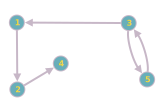

    - Grafo no dirigido G(V,E).
    - V = {1, 2, 3, 4, 5}
    - E = {(1,2), (2,4), (3,1), (3,5), (5,3)}

- **Grafo no dirigido**: en un grafo no dirigido, la relación sobre V es simétrica. Esto significa que _si existe_ una arista entre los vértices _u y v_, _entonces existe_ una arista _entre v y u_

    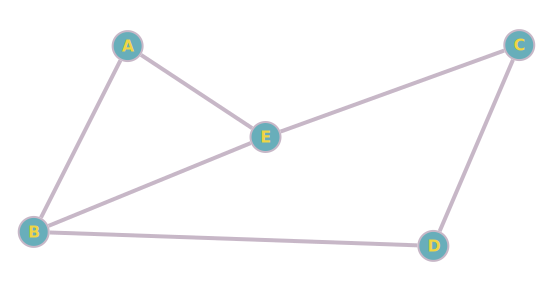

    - Grafo dirigido G(V,E).
    - V = {A, B, C, D, E}
    - E = {{B,A}, {B,E}, {B,D}, {A,E}, {C,D}, {C,E}}

- **Adyacencia**:  _v_ es adyacente a _u_ si existe una arista _(u,v)_ perteneciente a _E_.
- **Incidencia**: 
    - en un _grafo no dirigido_, una arista `(u,v)` **incide** en los vértices `u` y `v`. 
    - en un _grafo dirigido_, una arista `(u,v)` **incide** en v y **parte** de `u`.

- **Grado de un nodo**
    - En _grafos no dirigidos_ el grado de un nodo está dado por el número de arcos que inciden en él.
    - En _grafos dirigidos_ existen:
        - **grado de salida** `grado out`: es el número de arcos que parten de él.
        - **grado de entrada** `grado in`: es el número de arcos que inciden en él.
        - **grado del vértice**: será la suma de los grados de entrada y salida.

- **Grado de un Grafo**: es el máximo número de sus vértices.

- **Camino** desde `u` perteneciente a V a `v` perteneciente a V: secuencia _v<sub>1</sub>, v<sub>2</sub>, ..., v<sub>k</sub>_, tal que _u=v_

- **Longitud de un camino**

- **Camino Simple**

- **Ciclio**

- **Bucle**

- **Grafo acíclico**

- **Subgrafo**

- **Subgrafo Inducido**

- **Grafo ponderado, pesado o con costos**:

## Conectividad
### Conectividad en Grafos No Dirigidos
Un grafo no dirigido es **conexo** si hay un camino entre cada par de vértices.
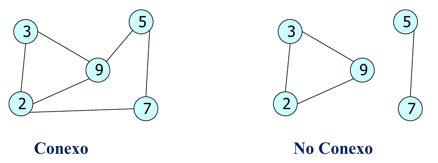

### Bosque y Árbol
- Un **bosque** es un grafo sin ciclos.
- Un **árbol libre** es un bosque conexo.
- Un **árbol** es un árbol libre en el que un nodo se ha designado como raíz.
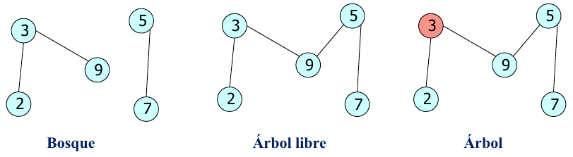

### Conectividad en Grafos Dirigidos
- `v` es **alcanzable** desde `u`, si existe un camino de `u` a `v`.
- Un grafo dirigido se denomina **fuertemente conexo** si existe un camino desde cualquier vértice a cualquier otro vértice.

- Si un grafo dirigido no es fuertemente conexo, pero el grafo subyacente (ignorando las direcciones de las aristas) es conexo, el grafo es **debilmente conexo**.

### Componentes Conexas
#### Componentes Conexas en Grafos No Dirigidos:
- Una **componente conexa** es un _subgrafo conexo_ tal que no existe otra componente conexa que lo contenga.
- Cada componente conexa es **maximal** (_subgrafo conexo maximal_), lo que significa que no se puede agregar ningún vértice adicional sin romper la propiedad de conexidad.
- Si un grafo no dirigido se encuentra formado por varias componentes conexas, se dice que el grafo es **no conexo**.
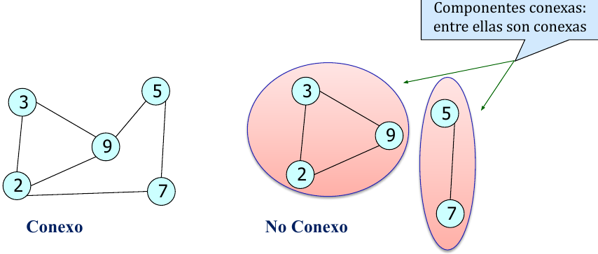

#### Componentes Fuertemente Conexas en Grafos Dirigidos: 
- Una **componente fuertemente conexa**, es el máximo subgrafo fuertemente conexo.

-  Un grafo dirigido es **no fuertemente conexo** si está formado por varias componentes fuertemente conexas.
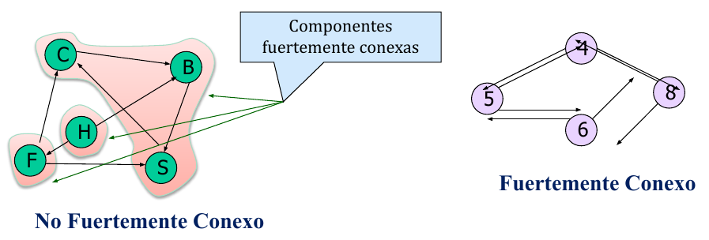

## Recorridos
### Recorrido en Profundidad: DFS (Depth First Search).
El DFS es un algoritmo de recorrido de grafos en profundidad. Generalización del recorrido preorden de un árbol.
#### Estrategia:
- Se comienza desde un vértice determinado.
- Se marca el vértice actual como visitado.
- Se explora xada camino que sale del vértice actual. Se profundiza cada camino hasta que se llega a un vértice ya visitado.
- Una vez que se termina de explorar un camino, se sigue con el siguiente no explorado, y se repite el proceso hasta que se hayan visitado todos los vértices alcanzables desde el vértice inicial
- Si existen vértices no alcanzables desde el vértice inicial, el recorrido quedará incompleto. En ese caso, se selecciona el vértice no visitado como nuevo vértice de partida y se repite el proceso.

#### Esquma recursivo: _Dado G = (V,E)_
1. Marcar todos los vértices como no visitados.
2. Elegir un vértice `u` como punto de partida.
3. Marcar `u` como visitado.
4. Para todo `v` adyacente a `u`, `(u,v)` perteneciente a _E_, si `v` no ha sido visitado, repeterir _3_ y _4_ para `v`
- Finalizar cuando se hayan alcnazado todos los nodos alcanzables desde `u`.
- Si desde `u` no fueron alcanbles todos los nodos del grafo: volver a _2_, elegir un nuevo vértice de partida `v` no visitado, y repetir el proceso hasta que se hayan recorrido todos los vértices.
- El recorrido del DFS depende del orden en que aparecen los vértices en las listas de adyacencia.

    ```
    /*pseudocódigo*/
    dfs(v: vértice){
        marca[v]:= visitado;
        para cada nodo w adyacente a v {
            si w no está visitado
                dfs(w);
        }
    }

    main: dfs(grafo){
        inicializar marca en false (arreglo de booleanos);
        para cada vértice v del grafo{
            si v no está visitado
                dfs(v);
        }
    }
    ```

    ```java
    //java
    public void dfs(Graph<T> grafo) {
        boolean[] marca = new boolean[grafo.getSize()];

        for (int i = 0; i < grafo.getSize(); i++){
            if (!marca[i]) {
                //imprimo dato del nodo con el que arranco el camino
                System.out.println("largo con: "+ grafo.getVertex(i).getData());    
                dfs(i, grafo, marca);
            }
        }
    }
    private void dfs(int pos, Graph<T> grafo, boolean[] marca) {
        marca[pos] = true;
        Vertex<T> v = grafo.getVertex(pos);
        //imprimo el dato del nodo que me encuentro en el camino
        System.out.println(v);

        List<Edge<T>> aristas = grafo.getEdges(v);

        Iterator<Edge<T>> i = aristas.iterator();

        while (i.hasNext()){
            int posVerticeDestino = i.next().getTarget().getPosition();

            if (!marca[posVerticeDestino])
                dfs(posVerticeDestino, grafo, marca);
        }
    }
    ```

#### Tiempo de ejecucución

### Recorrido en Amplitud: BFS (Breath First Search).
Es una generalización del recorrido por niveles de un árbol.
- _Primero se exploran todos los vértices a una distancia de 1 arista del vértice inicial, luego los vértices a una distancia de 2 aristas y así sucesivamente._
#### Estrategia:
- Partir de algún vértice _v_, visitar _v_, después visitar cada uno de los vértices adyacentes a _v_.
- Repetir el proceso para cada nodo adyacente a _v_, siguiendo el orden en que fueron visitados.

#### Esquma iterativo: _Dado G = (V,E)_
1. Encolar el vértice origen `u`
2. Marcar el vértice `u` como visitado
3. Procesar la cola.
4. -- Desencolar `u` de la cola
5. ---- Para todo adyacente a `u`, `(u,v)` perteneciente a _E_
6. ------ si `v` no ha sido visitado
7. -------- encolar y visitar `v`
- Si desde `u` no fueron alcanzados todos los nodos del grafo: volver a _1_, elegir un nuevo vértice de partida no visitado, y repetir el proceso hasta que se hayan recorrido todos los vértices.
- Costo _T(|V|,|E|)_ es de _O(|V|+|E|)_ (orden lineal).

    ```java
    public void bfs(Grafo<T> grafo) {
        boolean[] marca = new boolean[grafo.getSize()];
        for (int i = 1; i <= marca.length; i++) {
            if (!marca[i]){
                this.bfs(i, grafo, marca); //las listas empiezan en la pos 1
            }
        }
    }
    private <T> void bfs(int pos, Graph<T> grafo, boolean[] marca) {
		Queue<Vertex<T>> cola = new Queue<Vertex<T>>();
		cola.enqueue(grafo.getVertex(pos));
		marca[pos] = true;
		
		while(!cola.isEmpty()) {
			Vertex<T> vertice = cola.dequeue();
			System.out.println(vertice);
			List<Edge<T>> aristas = grafo.getEdges(vertice);
			
			for (Edge<T> arista: aristas) {
				int posVerticeDestino = arista.getTarget().getPosition();
				
				if (!marca[posVerticeDestino]) {
					marca[posVerticeDestino] = true;
					Vertex<T> verticeDestino = arista.getTarget();
					cola.enqueue(verticeDestino);
				}
			}
		}
	}
    ```

### Bosque de expansión generado a partir de un recorrido BFS
_Puede ser un árbol o una colección de árboles generados a partir de un recorrido BFS, donde cada árbol representa una parte conexa del grafo original. Cada árbol se forma a partir de un nodo inicial y las sucesivas visitas al los nodos adyacentes_.

_Se pueden generar un arbol o más de uno (bosque)_


- El recorrido **no es único**: depende del nodo incial y del orden de visita de los adyacentes.
- El orden de visita de unos nodos a partir de otros puede ser visto como un árbol.
- Si aparecen varios árboles: **bosque de expansión (o abarcador) en profundidad**

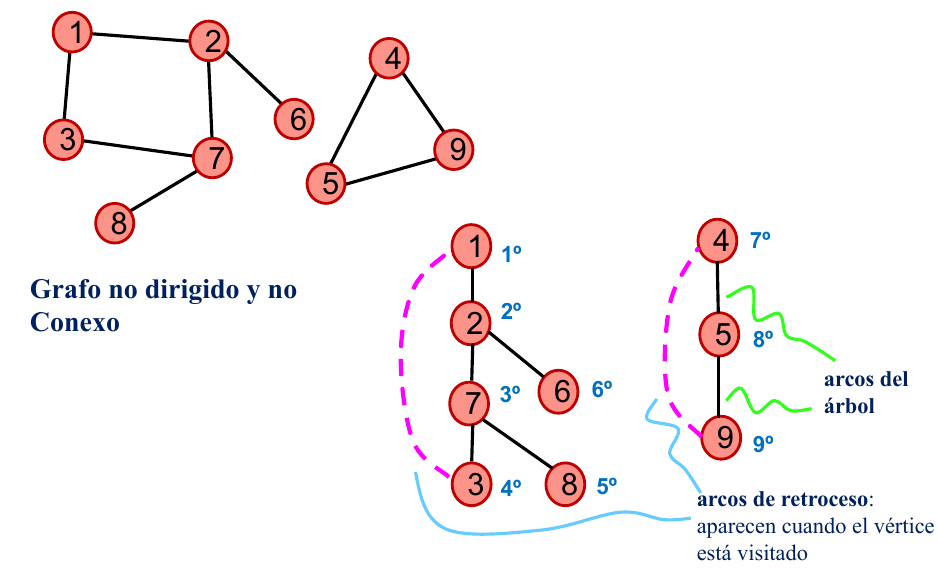


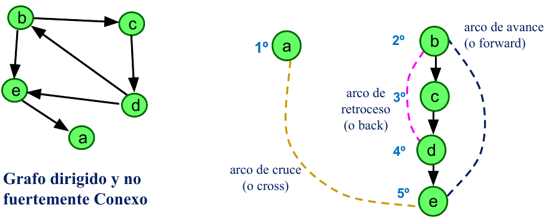


#### Clasificación de los arcos de un grafo dirigido en el bosque de expansión de un DFS

- Arcos **tree** (del árbol): son los arcos en el bosque depth-first-search, que conducen a vértices no visitados durante la búsqueda.
- Arcos **forward**: son los arcos _u→v_ que no están en el bosque, donde _v_ es _descendiente_, pero no es hijo en el árbol.
- Arcos **backward**: son los arcos _u→v_, donde _v_ es _antecesor_ en el árbol. Un arco de un vértice a si mismo es considerado un arco back.
- Arcos **cross**: son todos los otros arcos *u→v*, donde *v* no es ni antecesor ni descendiente de *u*. Son arcos que pueden ir entre vértices del mismo árbol
o entre vértices de diferentes árboles en el bosque depth-first-search.

**Ejemplo**: El recorrido en profundidad de un grafo G _no dirigido_ ha producido el árbol que se muestra en el figura, en el que cada nodo está numerado siguiendo el orden de visita del recorrido en profundidad.
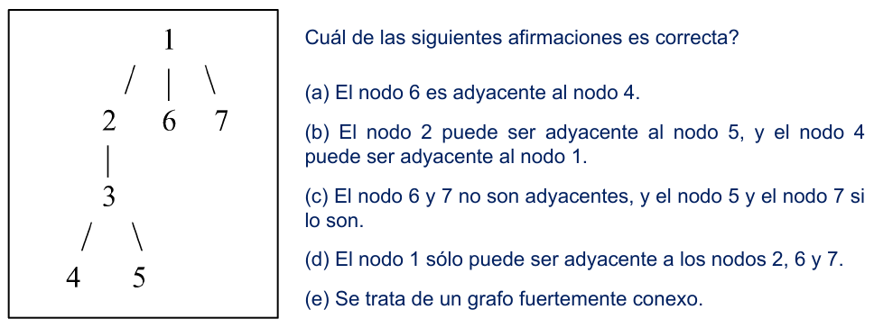

- **a** → F. Si 6 fuera adyacente al nodo 4, tendría que ser descendiente del nodo 4 al ser un _grafo no dirigido_.
- **b** → V. En el grafo original el nodo 2 puede ser adyancente al nodo 5 y el nodo 4 al nodo 1.
- **c** → F. Los nodos 6 y 7 no pueden ser adyacentes porque para que se cumpla el nodo 6 tendría que haber sido descendiente del nodo 7 antes de existir el camino de 1 a 7. En cambio los nodos 5 y 7 no son adyacentes por el mismo caso que el anterior.
- **d** → F. Puede ser adyacente además a los nodos 4 y 5 mediante una arista _backward_
- **e** → F. No se puede hablar de un grafo fuertemente conexo en un grafo no dirifigo. Solo podría ser conexo.

## Aplicaciones del DFS
### Problema 1: Encontrar las componentes conexas de un grafo _no dirigido_.
- Si el **grafo es conexo**: un recorrido desde cualquier vértice visitará a **todos** los vértices del grafo
- Si no lo es:
    - Partiendo desde un vértice, tendremos una componente conexa (conjunto de vértices recorridos).
    - Para descrubrir más componentes conexas, habrá que repetir el recorrido desde un vértice no visitado hasta que todos los vértices hayan sido visitados.

    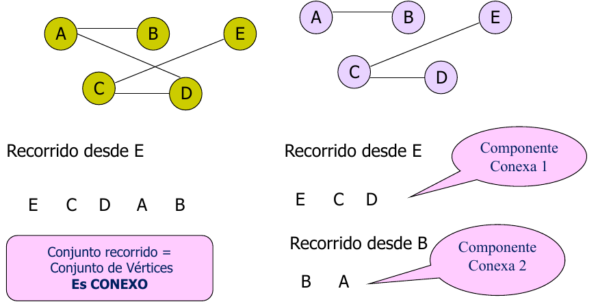

### Problema 2: Prueba de aciclicidad.
- En **Grafos No Dirigidos**: Hacer un recorrido dfs. Existe algún ciclo si y sólo si aparece algún arco que no es del árbol de expansión.
- En **Grafos Dirigidos** (digrafos): Hacer un dfs. Existe ciclo si y sólo si aparece algún arco de retroceso.

Orden de complejidad de la prueba de aciclicidad: igual que los recorridos.
- Con **matrices** de adyacencia: **O(|V|²)**.
- Con **listas** de adyacencia: **O(|V| + |E|)**.

### Problema 3: Encontrar las componentes fuertemente conexas.
Una aplicación clásica del depth-first search es descomponer un grafo dirigido en componentes fuertemente conexas (o conectadas).

Una **componente fuertemente conexa** de un grafo dirigido _G=(V,E)_ es el conjunto máximo de vértices _V’ ⊆ V_ tal que para cada par de vértices _u_ y _v_
en _V’_, existe un camino tanto _u→v_ como _v→u_.

**Algoritmo de Kosaraju**: _Es un algoritmo de tiempo lineal para encontrar las componentes fuertemente conexas de un digrafo._
- Se realizab dos dfs y se recorren todas las aristas una vez para crear el grafo reverso. _O(|V|+|E|)_

- Pasos:
    1. Aplicar DFS(G) rotulando los vértices de G en post-orden (apilar).
    2. Construir el grafo reverso de G, es decir G<sup>R</sup> (invertir los arcos).
    3. Aplicar DFS (G<sup>R</sup>) comenzando por los vértices de mayor rótulo (tope de la pila).
    4. Cada árbol de expansión resultante del paso 3 es una componente fuertemente conexa.
    - Si resulta **un único árbol** entonces el digrafo es **fuertemente conexo**.

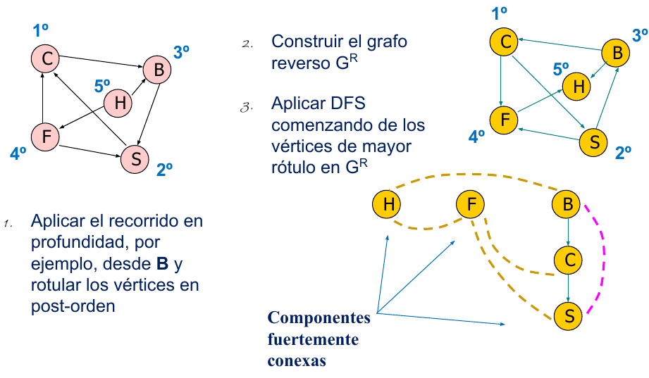

## Ordenación Topológica
La ordenación topológica es un permutación. Se **aplica a grafos dirigidos acíclicos (DAGs)**, 
- v<sub>1</sub>, v<sub>2</sub>, v<sub>3</sub>, ..., v<sub>|V|</sub> de los vértices, tal que si (v<sub>i</sub>, v<sub>j</sub>) pertenecientes a _E_, v<sub>i</sub> <> v<sub>j</sub>, entonces v<sub>i</sub> precede a v<sub>j</sub> en la permutación.
- La ordenación no es posible si G es acíclico.
- La ordenación topológica no es única.
- Una ordenación topológica es como una ordenación de los vértices a lo largo de una línea horizontal, con los arcos de izquierda a derecha.

### Algoritmos
- Con complejidad O( |V|2): 
    - Implementación con Arreglo (versión 1)
- Con complejidad O( |V| + |A| )
    - Implementación con Pila o Cola (versión 2)
    - DFS (versión 3)


### Versión 1, implementación con arreglo:
En esta versión el algoritmo utiliza un arreglo _Grado_in_ en el que se almacenan los grados de entradas de los vértices y en cada paso se toma de allí en vértice con _grado_in = 0_.

1. Seleccionar un vértice _v_ con grado de entrada 0.
2. Visitar _v_.
3. "Eliminar" _v_, junto con sus aristas salientes.
4. Repetir el paso 1 hasta seleccionar todos los vértices.


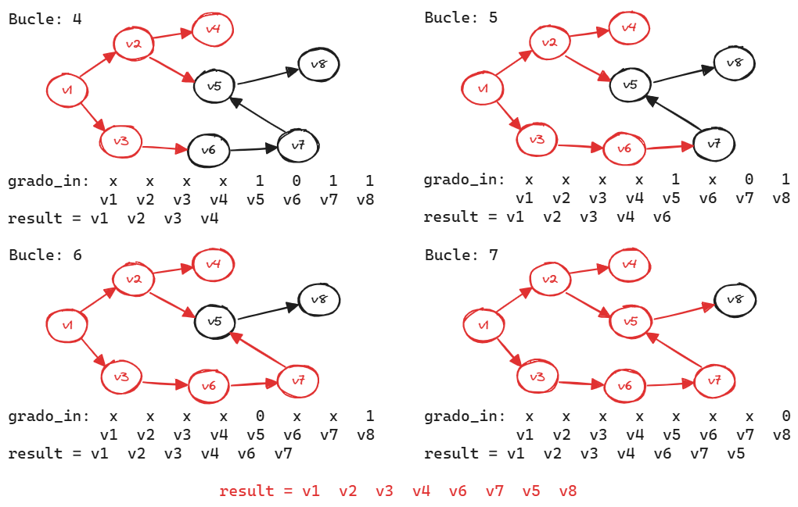

- Si en algún paso después de recorrer el arreglo para verificar el siguiente vértice que voy a visitar, no encuentro ninguno con _grado_in = 0_, es porque en el grafo hay un ciclo.

- EL algoritmo tiene un orden de **O(|V|<sup>2</sup> + |E|)**

```C
int sortTopologico( ){
    int numVerticesVisitados = 0;

    while(haya vertices para visitar){
        if(no existe vertice con grado_in = 0)
            break;

        else{
            // Búsqueda secuencial en el arreglo. => O(V)
            seleccionar un vertice v con grado_in = 0;     
            visitar v; //mandar a la salida
            numVerticesVisitados++;
            // Decrementar el grado de entrada de los adyacentes a v. => O(nroAristas de v)
            "borrar" v y todas sus aristas salientes;   
        }
    }
    return numVerticesVisitados;
}
```

### Versión 2, optimización de la version anterior con Pila o Cola: 
En esta versión el algoritmo utiliza un arreglo _Grado_in_ en el que se almacenan los grados de entradas de los vértices y una pila P (o una cola Q) en donde se almacenan los vértices con grados de entrada igual a cero.
- Recorre una sola vez el arreglo al principio para encontrar los vértices que tiene grado de entrada cero y son colocalodos en una pila o cola.
- En todos momento en la pila/cola va a ver un elemento para desapilar/desencolar, si este no fuera el caso es porque en el grafo se encuentra un ciclo.

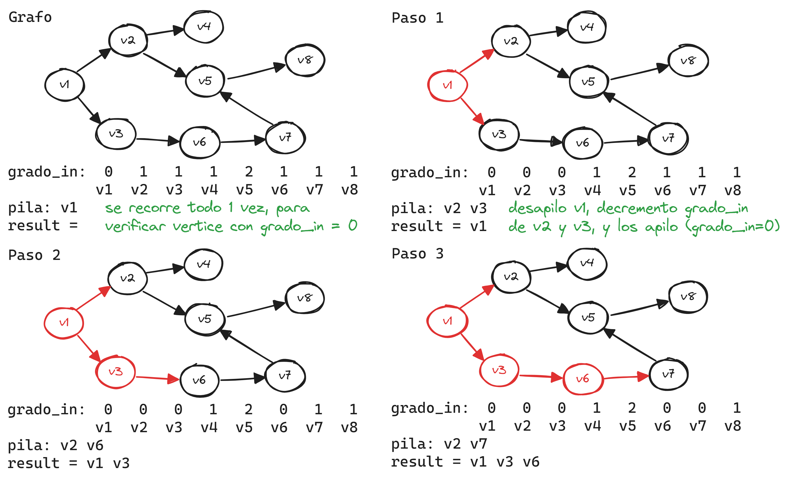
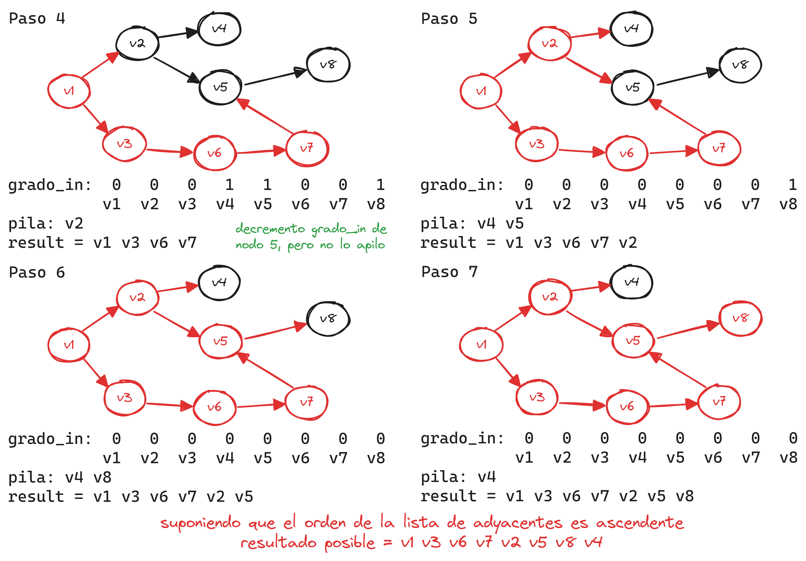

- EL algoritmo tiene un orden de **O(|V| + |E|)**

```C
int sortTopologico( ){
    
    int numVerticesVisitados = 0;
    
    while(haya vertices para visitar){
        if(no existe vertice con grado_in = 0)
            break;
        else{
            // Tomar el vértice de la cola => O(1)
            seleccionar un vertice v con grado_in = 0;
            visitar v; //mandar a la salida
            numVerticesVisitados++;
            // Decrementar el grado de entrada de los adyacentes de v.
            // Si llegó a 0, encolarlo. => O(nroAristas de v)
            borrar v y todas sus aristas salientes;
        }
    }
    return numVerticesVisitados;
}
```


### Versión 3, aplicando el recorrido en profundidad:
Se realiza un recorrido DFS, marcando cada vértice en post-orden, es decir, una vez visitados todos los vértices a partir de uno dado, el marcado de los vértices en post-orden puede implementarse según una de las siguientes opciones: 

1. numerándolos antes de retroceder en el recorrido; luego se listan los vértices según sus números de post-orden de mayor a menor.
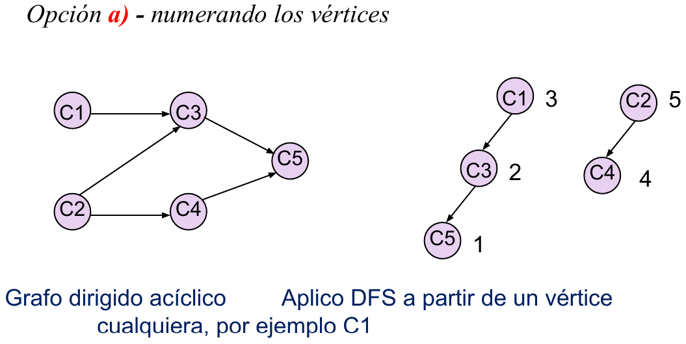

2. colocándolos en una pila P, luego se listan empezando
por el tope.
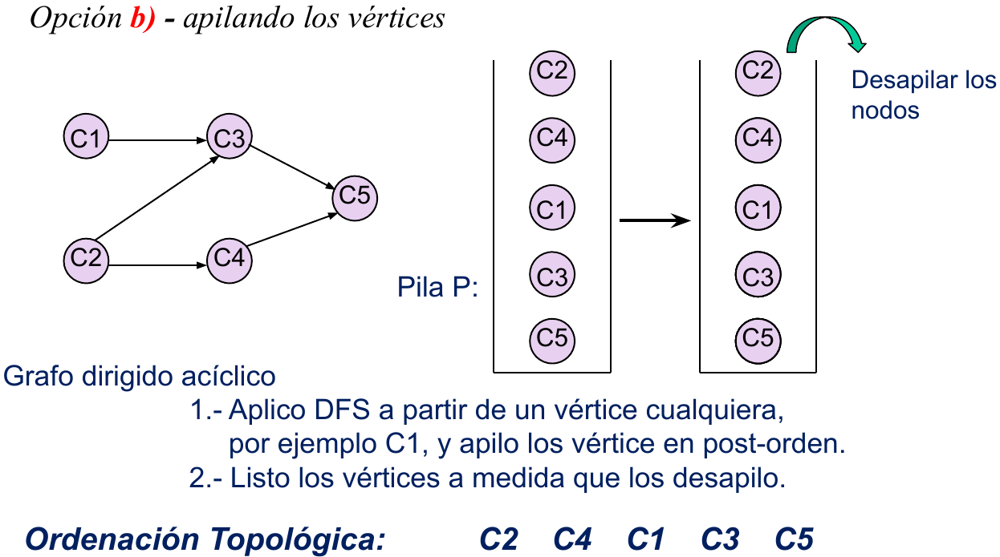


## Caminos de Costo Mínimo
Sea G=(V,A) un grafo dirigido y pesado (ponderado), el costo _c(i,j)_ está asociado a la arista _v(i,j)_.
- **Costo (peso) de un camino** **_<p = v<sub>1</sub>, v<sub>2</sub>, v<sub>3</sub>, ..., v<sub>n</sub>>:_** es la suma se los pesos de las aristas que lo forman.
- Este valor también se lo llama longitud del camino pesado.
- **Camino de mínimo costo (peso):** el camino de costo mínimo desde un vértice v<sub>i</sub> a otro vértice v<sub>j</sub> es aquel en que la suma de los costos de las aristas es mínima.

**La _longitud_ del camino de un _grafo no pesado_ es la cantidad de aristas.**

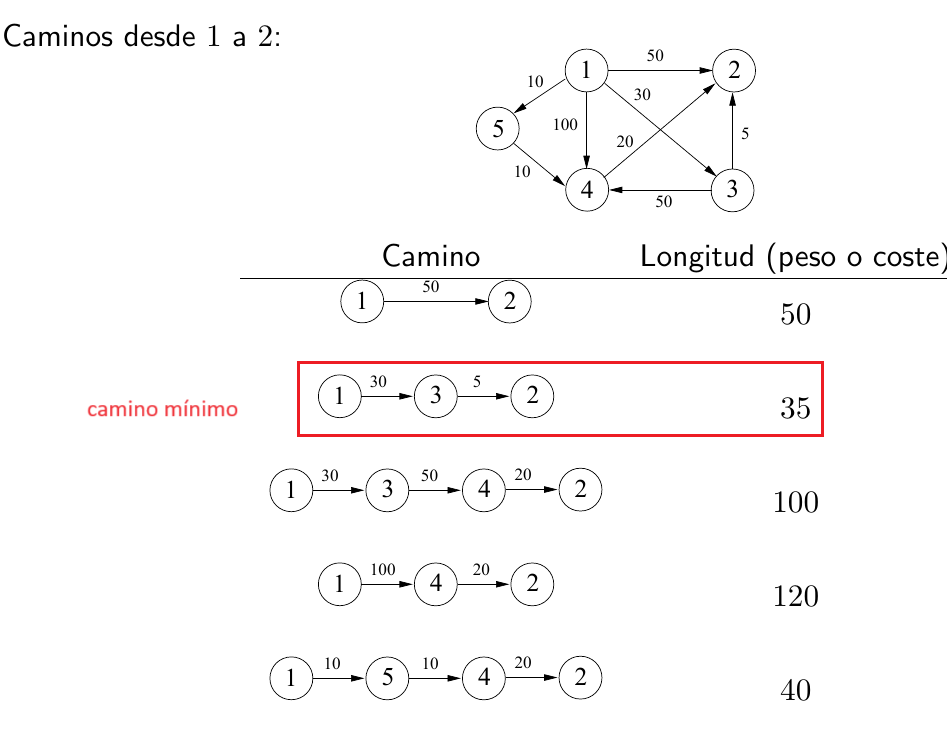

### Grafos sin Peso
Para cada vértice _v_ se mantiene la siguiente información:
- D<sub>v</sub> : distancia mínima desde el origen s (inicialmente ∞ para todos los vértices excepto el origen con valor 0).
- P<sub>v</sub> : vértice por donde paso para llegar.
- Conocido: dato booleano que me indica si está  procesado (inicialmente todos en 0).
    - este último campo no es necesario par esta clase de grafos.

#### Estrategia: Recorrido en amplitud (BFS)
Pasos:
- Avancar por niveles a partir del origen, asignando distancias según se avanza (se utiliza un cola).
- Inicialmente, es D<sub>w</sub> = ∞. 
    - al inspeccionar _w_ se reduce al valor correcto D<sub>w</sub> = D<sub>v</sub> + 1
- Desde cada _v_, visitamos a todos los nodos adyacentes a _v_.

### Grafos con pesos positivos
#### Estrategia: Algoritmo de Dijkstra.
- Pasos:
    1. Dado un vértice orige _s_, elegir el vértice _v_ que se encuentre a la menor distancia de _s_, dentro de los vértices no procesados.
    2. Marcar _v_ como procesado.
    3. Actualizar la distancia de _w_ adyacente a _v_

- Para cada vértice _v_ se mantiene la siguiente información.
    - D<sub>v</sub> : distancia mínima desde el origen s (inicialmente ∞ para todos los vértices excepto el origen con valor 0).
    - P<sub>v</sub> : vértice por donde paso para llegar.
    - Conocido: dato booleano que me indica si está  procesado (inicialmente todos en 0).

- La actualización de la distancia de los adyacentes _w_ se realiza con el siguiente criterio:
    - Se compara **D<sub>w</sub>** _(distancia de s a w sin pasar por v)_ con **D<sub>v</sub> + c(v,w)** _(distancia de s a w, pasando por v)_
    - Se actualiza si **D<sub>w</sub> > D<sub>v</sub> + c(v,w)**

### Grafos con pesos negativos y positivos
#### Estrategia: Encolar los vértices.
- Si el grafo tiene aristas negativas, el algoritmo de Dijkstra puede dar un resultado erroneo
- Pasos
    1. Encolar el vértice origen _s_.
    2. Procesar la cola:
        1. Desencolar un vértice.
        2. actualizar la distancia de los adyacentes D<sub>w</sub> siguiendo el mismo criterio que Dijkstra.
        3. si _w_ no está en la cola, econlarlo.
- El costo total del algoritmo es de O(|V|*|E|).

### Grafos acíclicos
#### Estrategia: Orden Topológico
- Optimización del alogitmo de Dijkstra.
- La selección de cada vértice se realiza siguiendo el orden topológico.
- Esta estrategia funciona correctamente, dado que al seleccionar un vértice _v_, no se va a encontrar una distancia d<sub>v</sub> menor, porque ya se procesaron todos los caminos que llegan a él.
- El costo del algoritmo es de _O(|V|+|E|)_
